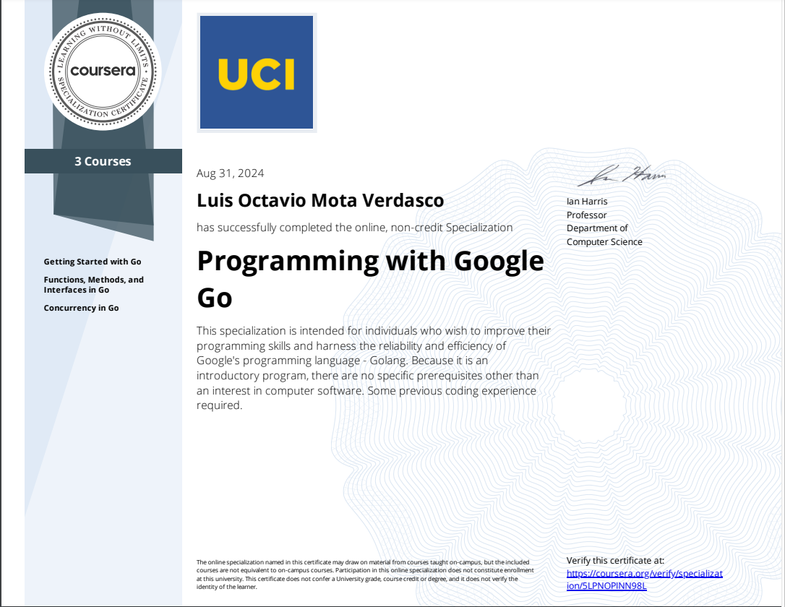

# Programming with Google Go Specialization

## Certifications

1. [Getting Started with Go](https://www.coursera.org/verify/Q19HQRIN6N2C)
2. [Functions, Methods, and Interfaces in Go](https://www.coursera.org/verify/O69ONZY9NQ59)
3. [Concurrency in Go](https://www.coursera.org/verify/3KR6AQ25KZXP)